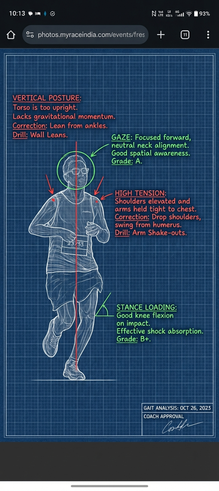

# MyNextPR

> AI-powered running gait analysis that turns a simple photo into a vintage engineering blueprint — like having a world-class biomechanics coach in your pocket.

---

## What It Does

**MyNextPR** democratizes professional running gait analysis. Instead of expensive lab assessments or inaccessible coaches, users upload a single running photo and receive a detailed, stylized biomechanical audit.

### Input → Output

| Input (Your Running Photo) | Output (AI Blueprint Analysis) |
|:---:|:---:|
|  |  |

The system detects your pose, assesses biomechanical metrics (foot strike, hip drop, forward lean, arm carriage), and generates a vintage engineering-style blueprint with annotated corrections, drills, and injury-risk warnings.

---

## Tech Stack

| Layer | Technology |
|-------|------------|
| **Frontend** | React 18, Vite, TypeScript, Tailwind CSS, Shadcn UI |
| **Backend** | Python 3.9+, FastAPI, Uvicorn |
| **Database** | SQLite |
| **AI Models** | Google Gemini 1.5 Pro (Analysis + Image Generation) |
| **Infrastructure** | AWS EC2, Nginx, PM2 |

---

## Architecture

```
User Upload → React Frontend → Nginx (SSL/443) → FastAPI Backend
                                    ↓
                          Auth + Usage Limit Check
                                    ↓
                    Step 1: Gemini Flash (Biomechanical Analysis)
                                    ↓
                    Step 2: Gemini Pro (Blueprint Image Generation)
                                    ↓
                    Post-Processing (Watermark, Composite)
                                    ↓
                         Return Image URL → Display
```

---

## Features

- **2-Step AI Pipeline**
  - Step 1: Forensic biomechanical analysis with strict grading (A–F)
  - Step 2: Stylized blueprint generation with annotated corrections
- **Usage Tracking**
  - 4 free generations per user
  - Admin tools to reset or grant unlimited access
- **Social Sharing**
  - Open Graph meta tags for rich link previews
  - Shareable result pages
- **History**
  - Users can view past analyses
- **Admin Scripts**
  - `get_report.sh` — view activity
  - `manage_user.sh` — reset usage / grant unlimited
  - `sync_images.sh` — download all generated images

---

## Quick Start

### 1. Clone & Configure

```bash
git clone <your-repo-url>.git
cd mynextpr
cp .env.example .env
# Edit .env with your API keys
```

### 2. Install Dependencies

```bash
# Python backend
pip install -r requirements.txt

# React frontend
cd mynextpr-544b6987
npm install
```

### 3. Run

```bash
# Terminal 1 — Backend
python backend/main.py

# Terminal 2 — Frontend
cd mynextpr-544b6987
npm run dev
```

Visit `http://localhost:8080` (or the port Vite reports).

---

## Project Structure

```
.
├── backend/                  # FastAPI backend
│   ├── main.py               # API server & auth
│   ├── database.py           # SQLite schema & queries
│   ├── run_pipeline.py       # AI pipeline (loaded from root)
│   ├── manage_users.py       # CLI user management
│   └── report_activity.py    # Activity reports
├── mynextpr-544b6987/        # React frontend (Vite)
│   ├── src/pages/            # Upload, Result, Login, etc.
│   └── public/               # Static assets
├── run_pipeline.py           # Core 2-step AI logic
├── base_prompt.txt           # System prompt for Gemini
├── nginx.conf                # Nginx reverse proxy config
├── deploy.sh                 # EC2 deployment script
└── requirements.txt          # Python dependencies
```

---

## Security Note

**Never commit `.env` to Git.** The repo includes `.env.example` with placeholder values. Real credentials live in your local `keys/private.md` (kept outside version control).

---

## License

© MyNextPR. All rights reserved.
