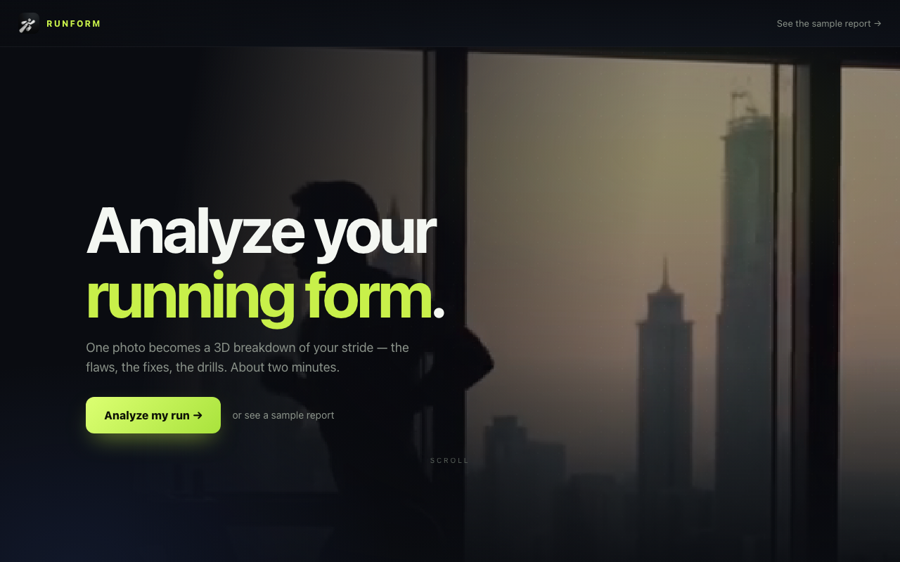
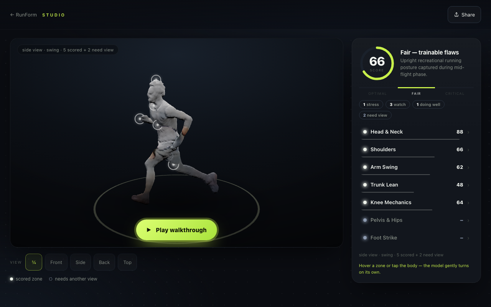
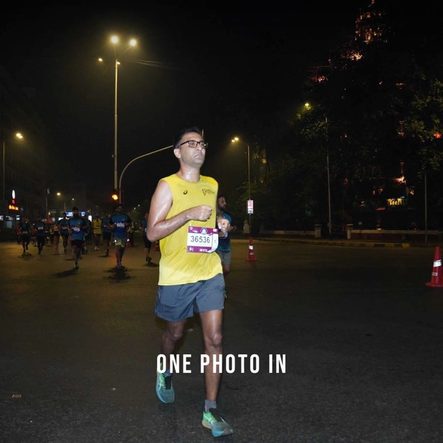
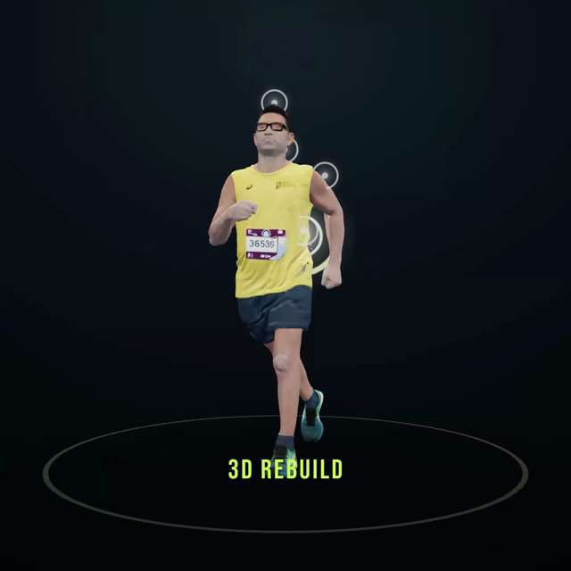
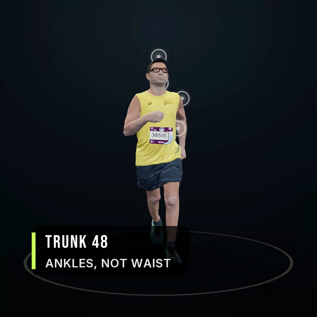
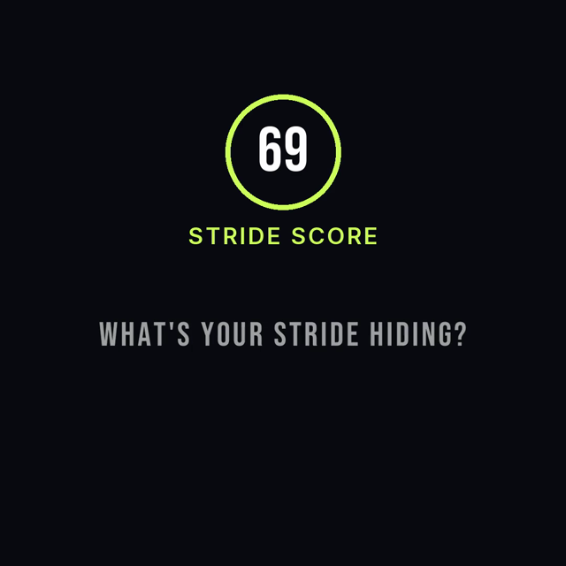
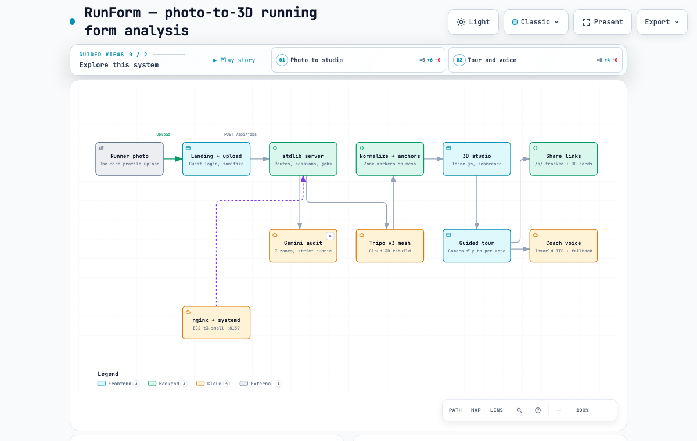

# RunForm — one photo becomes a 3D running-form breakdown

<p align="center">
  
</p>

<p align="center">
  <strong>Live at <a href="https://mynextpr.com">mynextpr.com</a></strong> ·
  Upload one running photo, get an AI form score, zone-by-zone flaws with fixes,
  your stride rebuilt in 3D, and a coach who walks you through it out loud.
  Free, about two minutes.
</p>

<p align="center">
  <a href="https://mynextpr.com"></a>
</p>

<p align="center">
  
</p>

<video src="site/assets/hero-run.mp4" poster="site/assets/hero-run.jpg" width="860" controls muted loop></video>

## How it works

```
runner photo → stdlib server → ┬─ Gemini audit (7 zones, strict rubric) ─┐
                               └─ Tripo v3 cloud mesh ──→ normalize ──→ anchors
                                                          ↓
                                              3D studio + voice walkthrough
```

1. **Upload** — guest login (no password, no email), one side-profile photo, sanitized server-side.
2. **Audit + rebuild in parallel** — a research-grounded Gemini audit scores 7 body zones while Tripo's cloud API rebuilds you as a textured 3D mesh. A single-job queue with fail-loud errors keeps the small server honest.
3. **Studio** — orbit the mesh, tap glowing zone markers, read ideal-vs-yours diagrams, then press play: the camera flies to each weak zone while the coach explains the fix. Shareable link included.

<p align="center">
  
</p>

## The rebuild, frame by frame

Stills from the homepage cut — one night-race photo in, a textured 3D runner out, every zone scored:

| One photo in | Rebuilt in 3D |
|---|---|
|  |  |
| Every zone gets a fix | One stride score |
|  |  |

## Features

- **7-zone biomechanics audit** — head/neck, shoulders, arms/elbows, trunk lean, hips/pelvis, knees, foot strike; each scored 0–100 with observation, signs, TL;DR, ELI5, two cues + one drill, and a biomechanics evidence line.
- **Honest scoring** — optimal ≥ 85, fair 60–84, critical < 60; overall is the mean of scored zones, capped (any critical → ≤ 70, two or more → ≤ 60) so visible flaws can never hide behind a 90+.
- **Knows what it can't see** — a per-camera judgeability matrix plus flight-phase guards: side views can't judge hips, flight frames can't judge foot strike. Unjudgeable zones return `insufficient` with the exact photo needed instead of a guess.
- **Textured 3D rebuild** — Tripo v3 cloud mesh (fast/best lanes), normalized server-side, zone anchors projected onto the body.
- **Interactive studio** — Three.js orbit/zoom, raycast marker picking, hover badges showing the score alone, detail cards with ideal-vs-yours anatomy diagrams, view presets (¾/front/side/back/top), auto-turntable.
- **Voice walkthrough** — Inworld TTS coach (Kabir default, more voices), Kokoro/system fallback, lines prefetched so playback is instant; camera pans to each of the three weakest zones in turn at 4× turntable speed; rapid prev/next can never stack two voices.
- **Thumb-first mobile** — 44px tour tray, captions removed, full-width tray, short-landscape fold fit; portrait + landscape verified at 390×844.
- **Sharing + previews** — tracked `/s/` links, per-report OG cards from your run, logo favicon set, Organization + FAQ JSON-LD, sitemap/robots.
- **Lean ops** — dependency-free Python HTTP server, systemd unit + nginx confs in `deploy/`, TTS response cache, QA suites (`e2e_check.sh`, Selenium `qa_browser_e2e.py`, Playwright `qa_studio_tour.py`, pipeline battle-bot `qa_bot.py`).

## Evidence base — what goes into the report

Every scored finding must carry 1–2 sentences of established biomechanics consensus. The audit rubric names its authorities (author-name-only by design), and the coaching layer encodes their principles as concrete rules:

| Source | What it contributes | Wired in |
|---|---|---|
| Lieberman et al., *Nature* 463:531–535 (2010) — foot-strike patterns and collision forces in barefoot vs shod runners ([doi](https://doi.org/10.1038/nature08723)) | Midfoot landing under the hips, short light steps; overstriding = braking impulse | `feet_strike` findings + evidence lines; `step1_prompt.txt` |
| Cavanagh & Lafortune, *J. Biomech.* 13:397–406 (1980) — ground reaction forces in distance running ([doi](https://doi.org/10.1016/0021-9290(80)90033-0)) | Impact loading, stance vs flight claims, knee absorption only on visible ground contact | Flight-phase guards, knees findings; `step1_prompt.txt` |
| Head/neck ideal — eyes level, chin over chest, long neck | Gaze cue + 15 m stare self-test | `ZONE_KB.head_neck`, `site/report_template.html` |
| Shoulders ideal — low, level, relaxed | Shrug-and-drop cue | `ZONE_KB.shoulders` |
| Arms ideal — ~90° elbows driving back, loose hands | Hip-brush self-test | `ZONE_KB.arms_elbows` + ideal-vs-yours diagram |
| Trunk ideal — whole-body lean from the ankles, never the waist | Wall-fall self-test | `ZONE_KB.trunk_lean` |
| Hips ideal — level pelvis, neutral, front-view only | Single-leg mirror test | `ZONE_KB.hips_pelvis` + judgeability matrix |
| Knees ideal — track over foot, quick recovery | High-knee march test | `ZONE_KB.knees` |
| Feet ideal — land close under hips, quiet, ~170+ cadence | 30-second step-count test | `ZONE_KB.feet_strike` + cadence-ladder drill |
| Gemini 3.8 Flash | Strict zone audit + JSON scores | `site/server.py` → `gemini_audit`, `step1_prompt.txt` |
| Tripo v3 API | Textured mesh rebuild (fast 50k / best 100k faces) | `site/tripo_cloud.py` |
| Inworld TTS (+ Kokoro / system fallback) | Coach voiceover | `site/server.py` → `/api/tts`, tour engine |

## Architecture — archify me

System map generated with [archify](https://github.com/tt-a1i/archify) (MIT) from a hand-authored JSON spec of this codebase — validated `ok`, 0 errors, 0 warnings. Open the interactive version (guided views, search, trace) or read the spec:

<p align="center">
  <a href="docs/architecture/index.html"></a>
</p>

- Interactive map: [`docs/architecture/index.html`](docs/architecture/index.html) (self-contained, works offline)
- Spec: [`docs/architecture/runform.architecture.json`](docs/architecture/runform.architecture.json)

## Run it locally

```bash
python3 -m venv .venv && source .venv/bin/activate
pip install -r requirements-light.txt
cp .env.example .env   # add GEMINI_API_KEY + TRIPO_API_KEY for the full pipeline
python site/server.py 8139
```

Open http://127.0.0.1:8139. Without API keys the studio still runs end to end on a stand-in mesh so every screen stays clickable.

## Deploy

`deploy/` holds the production units: `t3-small-systemd.conf` (stdlib server on :8139) and `t3-small-nginx.conf` (TLS + static caching at the edge). The live site is one small EC2 box.

## Privacy note

This repo contains **no API keys, no credentials, and no private running photos**. The only human imagery is the homepage demo run itself (`site/assets/hero-run.*`, `showcase.mp4`, screenshots in `docs/`) — the same media the public site shows. All `jobs/`, reference inputs, and environment files were stripped before publishing.

## License

MIT — see [LICENSE](LICENSE).


